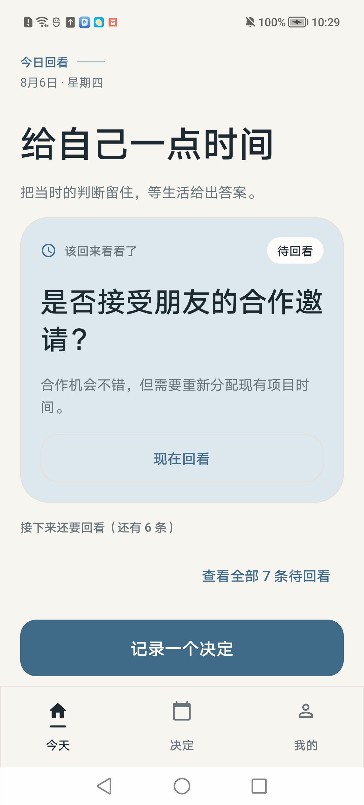
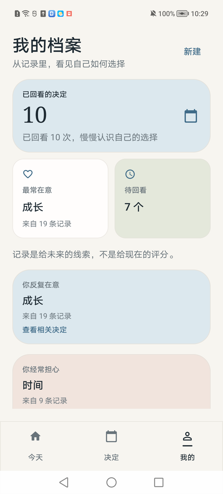
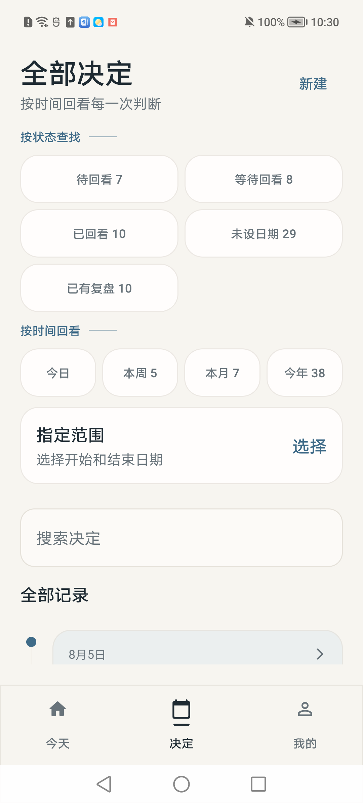
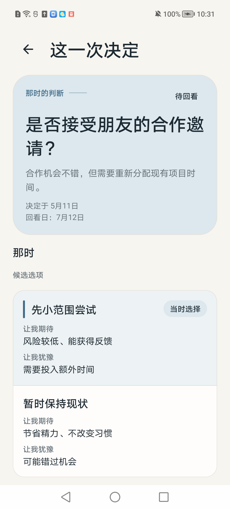
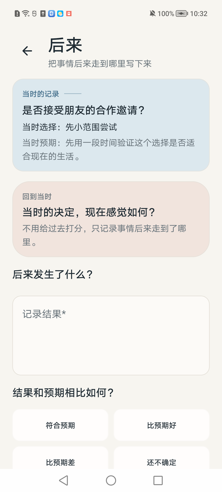

# 回看 · Decision Journal

> 看见自己是如何做决定的。

「回看」是一款本地优先的个人决策记录与复盘应用。它不替你决定，而是帮你**把当下的判断留住，等生活给出答案**——在重要选择的关口写下问题、依据、在意的事和预期；等事情走过一段路，再回来对照现实；当记录积累之后，慢慢看见自己的价值排序、决策风格和那些被高估的担忧。

所有数据只保存在你的设备本地，离线可用，没有账号，没有云端上传，也没有 AI 替你下结论。

---

## 产品截图

| 今日回看 | 记录决定 | 决定时间线 |
| :---: | :---: | :---: |
|  |  |  |

| 决定详情 | 写下复盘 |
| :---: | :---: |
|  |  |

---

## 核心体验：一个围绕「决定」的完整闭环

一条记录对应一次真实的决定，并沿着三个时间层展开：

```
当时 ──► 未来 ──► 后来 ──► 认识自己
```

1. **当时**：记录问题、背景、候选方案、你在意与担心的事、对结果的预期和当下的信心。
2. **未来**：设置一个回看日期，给未来的自己留下一封简短的信；到那天晚上，应用会安静地提醒你回来看看。
3. **后来**：写下事情实际走到哪里——结果是否符合预期、你的满意度、哪些判断被验证、哪些担忧被高估、下次会注意什么。
4. **认识自己**：「我的」档案从你真实的记录里，慢慢显影出你反复在意什么、经常担心什么，以及决策的长期节奏。

---

## 功能一览

- **三步式创建**：写下问题 → 比较选择 → 留给未来。候选选项支持添加、编辑、排序、删除与最终选择，也可以先不确定。
- **回看与复盘**：记录结果、对照预期、满意度评分与观察笔记；复盘可更正、可删除，时间线始终保留完整的"当时/后来"对照。
- **回看提醒**：为未来回看日安排提醒，当天晚上 8 点左右送达。通知是可选能力——拒绝权限也不会影响保存任何内容。
- **时间线与检索**：按时间回看每一次判断，支持状态筛选（待回看/等待回看/已回看/未设日期）、时间筛选（今日/本周/本月/今年/自定义范围）与全文搜索。
- **首页今日回看**：打开应用第一眼就是今天该回看的决定，附一条直接入口。
- **自我洞察**：当记录达到一定数量，自动生成可追溯的观察（如"你反复在意 · 生活平衡 · 来自 5 条记录"），一切源于你自己的文字。

---

## 设计语言：静谧档案

「回看」采用 **静谧档案（Quiet Archive）** 的设计语言：暖纸色背景、墨色文字、低饱和的蓝灰主色，以及克制的圆角和留白。界面保持低打扰、易阅读，让**你的原始文字成为视觉中心**——日期与间隔用细线、色点和留白表达，而不是堆积卡片与标签。

---

## 隐私与数据

- 所有决策、候选、寄语与复盘内容**默认只保存在设备本地**，核心流程完全离线。
- 不包含账号、云同步、远程 AI 分析，也不替用户做决定。
- Release 构建从不写入示例数据；演示数据仅作为开发/测试 fixture 显式加载。

---

## 下载与安装

最新版本：[GitHub Releases](https://github.com/ClongPang/DecisionJournal/releases)

- 下载 `app-release.apk` 后安装到 Android 设备（要求 Android 8.0 / API 26 及以上）。
- 首次安装请在系统提示中允许"安装未知来源应用"。

---

## 技术栈

Kotlin · Jetpack Compose · Material 3 · Room · Hilt · WorkManager · Compose Navigation

当前构建基线：Android SDK 37 · AGP 9.3.0 · Gradle 9.6.1。

---

## 开发与构建

使用 Android Studio 打开本目录，Gradle Sync 完成后运行 `app` 配置即可。

日常构建与测试：

```bash
./build-debug.sh        # 构建 Debug APK → app/build/outputs/apk/debug/app-debug.apk
./test-connected.sh     # 在已连接的真机/模拟器上运行单元测试 + AndroidTest
```

构建 release 并发布：

```bash
# 1. 本地配置 keystore.properties（gitignored）：storeFile / storePassword / keyAlias / keyPassword
GRADLE_USER_HOME="$PWD/.gradle-user-home" ANDROID_USER_HOME="$PWD/.android-user-home" ./gradlew :app:assembleRelease
# 2. 打 tag 并发布（需要 gh 已授权）
git tag v0.1.0 && git push origin v0.1.0
gh release create v0.1.0 app/build/outputs/apk/release/app-release.apk --title "回看 0.1.0" --notes "..."
```

> 依赖版本已锁定。不要单独升级 AGP、Kotlin、KSP 或 Hilt——请按兼容版本组一起升级，并重新执行构建与测试。
